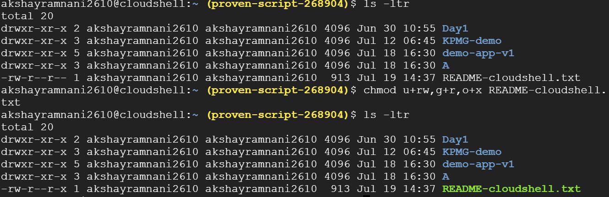
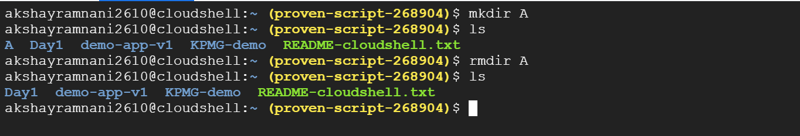
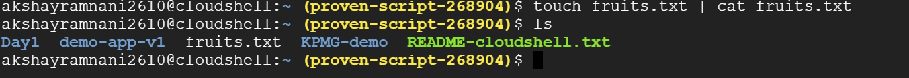
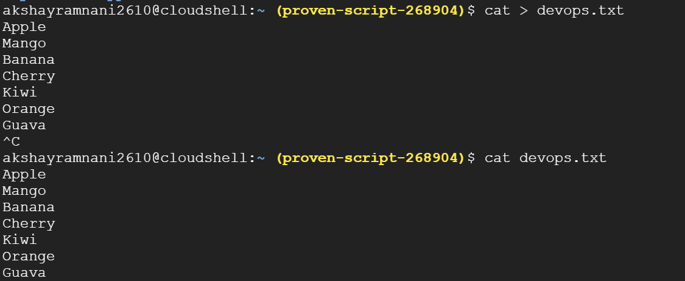
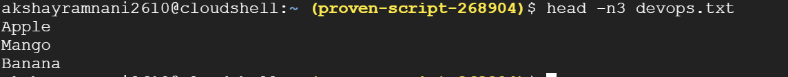
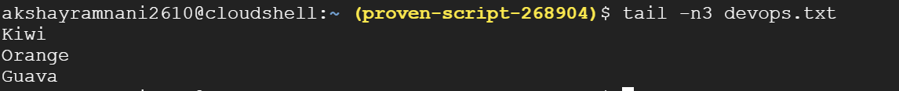
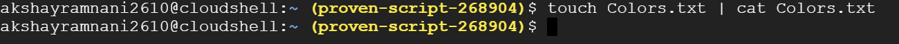
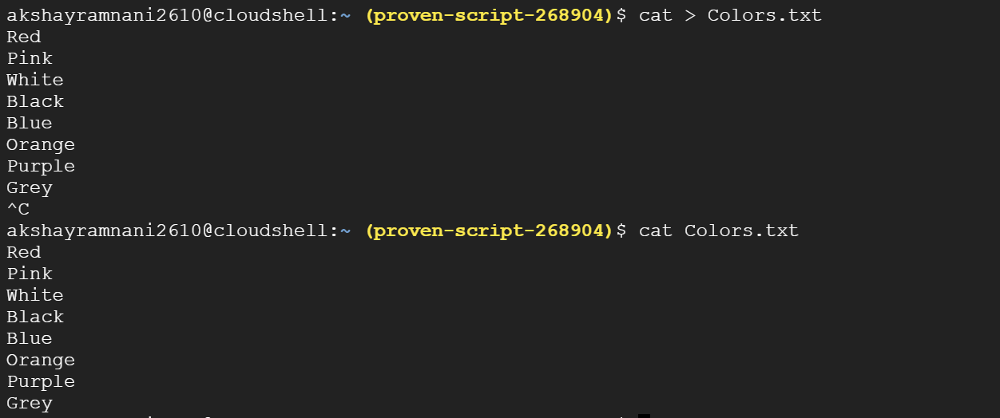
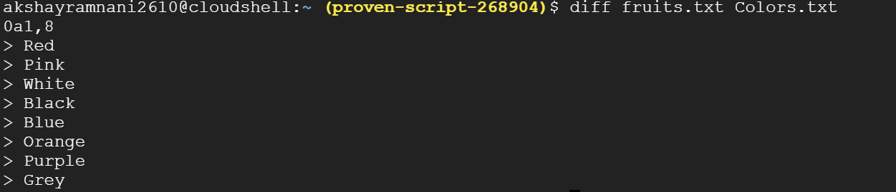

1. To view what's written in a file.

2. To change the access permissions of files.

3. To check which commands you have run till now.

4. To remove a directory/ Folder.

5. To create a fruits.txt file and to view the content.

6. Add content in devops.txt (One in each line) - Apple, Mango, Banana, Cherry, Kiwi, Orange, Guava.

7. To Show only top three fruits from the file.

8. To Show only bottom three fruits from the file.

9. To create another file Colors.txt and to view the content.

10. Add content in Colors.txt (One in each line) - Red, Pink, White, Black, Blue, Orange, Purple, Grey.

11. To find the difference between fruits.txt and Colors.txt file.

